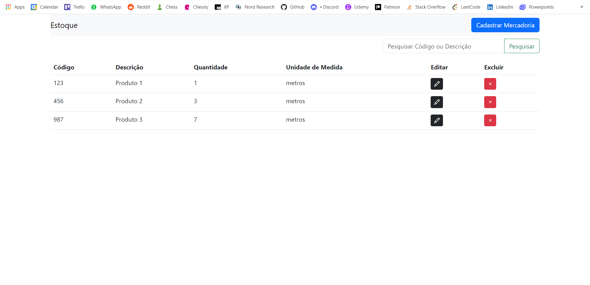

# estoque-keevotec
Aplicação web para controle de estoque. Desenvolvida com Angular, Django e MySQL.

### Funcionalidades do Sistema:

- Cadastro de Mercadorias:
Permite aos usuários cadastrar novas mercadorias no sistema.
Os campos como código, descrição, quantidade inicial e unidade de medida são preenchidos para manter informações detalhadas.

- Edição de Mercadorias:
Permite aos usuários editar as informações de mercadorias já cadastradas.
Facilita a correção de erros ou a atualização de dados quando necessário.

- Exclusão de Mercadorias:
Possibilita aos usuários remover mercadorias do sistema.
Útil para casos em que uma mercadoria não está mais em estoque ou não é mais relevante.

- Visualização de Mercadorias:
Exibe uma lista completa de todas as mercadorias cadastradas.
Mostra informações como código, descrição, quantidade atual e unidade de medida para uma visão geral.

- Pesquisa de Mercadorias:
Permite aos usuários buscar mercadorias específicas com base no código ou descrição.
Agiliza o processo de localização de mercadorias em um grande estoque.

- Responsividade:
O sistema é projetado para ser responsivo e se adaptar a diferentes tamanhos de tela, proporcionando uma experiência consistente em dispositivos desktop e móveis.

Essas funcionalidades foram desenvolvidas para simplificar a administração do estoque.

### Demostração do Projeto

Vídeo demostrativo do Site: 

